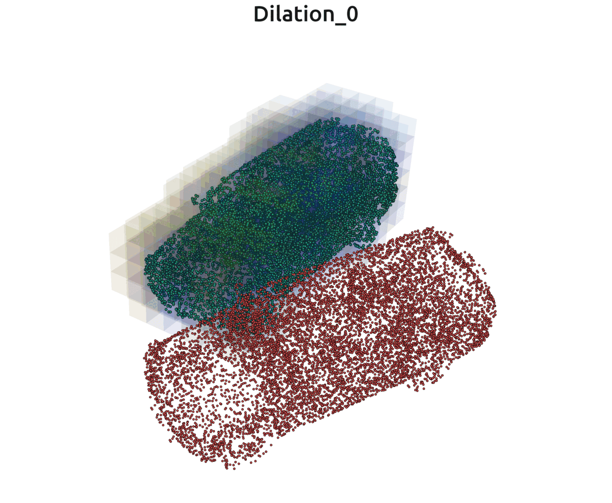

# VAN-ICP: GPU-Accelerated Approximate Nearest Neighbor Search for ICP Registration via Voxel Dilation

## Introduction

This repository is the efficient CUDA implementation of VAN-ICP (Voxel-dilAtioN-based ICP) for 3D point cloud registration. VAN-ICP accelerates the nearest neighbor search (NNS), the most computationally intensive step in ICP, with a dilated voxel strategy. NNS can be performed locally instead of globally when points are close. Voxelization is applied to form local areas, and dilation of voxelization is proposed to increase overlap areas. The method is especially suitable for parallel processing and GPU acceleration.

## Voxel Dilation

Voxel maps with different dilation layers (0-10) at the voxel resolution of 4. Colors indicate indexes of root voxels, namely voxels with the same color are dilated from the same root voxel. As the number of dilation layers increases, overlap areas expand. As the number of dilation layers increases, overlap areas increase.

  

<!-- 
Dilation of voxelized point cloud
 -->

## VAN-ICP Registration

The registration example of VAN-ICP. As the iterations proceed, overlap areas also increase.

  

  <!-- 
VAN-ICP registration
 -->

## Usage

### Dependency

* CUDA == 10.2

  **To be updated**

## Acknowledgments
